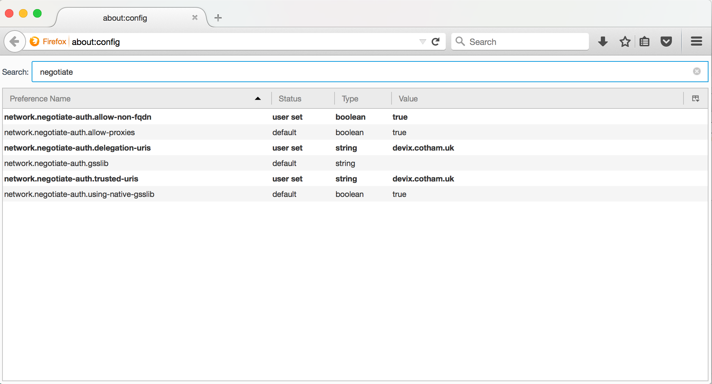

<!---
  Licensed under the Apache License, Version 2.0 (the "License");
  you may not use this file except in compliance with the License.
  You may obtain a copy of the License at
  
   http://www.apache.org/licenses/LICENSE-2.0
  
  Unless required by applicable law or agreed to in writing, software
  distributed under the License is distributed on an "AS IS" BASIS,
  WITHOUT WARRANTIES OR CONDITIONS OF ANY KIND, either express or implied.
  See the License for the specific language governing permissions and
  limitations under the License. See accompanying LICENSE file.
-->

# Web, REST and SPNEGO

SPNEGO is the acronym of the protocol by which HTTP clients can authenticate with a web site using Kerberos. This allows the client to identify and authenticate itself to a web site or a web service.
SPNEGO is supported by

* The standard browsers, to different levels of pain of use
* `curl` on the command line
* `java.net.URL` in Java7+

The final point is key: it can be used programmatically in Java, so used by REST client applications to authenticate with a remote Web Service.

Exactly how the Java runtime implements its SPNEGO authentication is a mystery to all.
Unlike, say Hadoop IPC, where the entire authentication code has been implemented by people whose email addresses you can identify from the change log and so ask hard questions, what the JDK does is a black hole.

The sole source of information is the JDK source, and anything which IDE decompilers
can add if you end up stepping in to vendor-specific classes.

There is [one readme file](https://github.com/ddopson/openjdk-test/blob/master/sun/net/www/protocol/http/spnegoReadme) hidden in the test documentation.


## Configuring Firefox to use SPNEGO

Firefox is the easiest browser to set up with SPNEGO support, as it is done in `about:config `and then persisted
Here are the settings for a local VM, a VM which has an entry in the `/etc/hosts`:

```
192.168.1.134 devix.cotham.uk devix
```

This hostname is then listed in firefox's config as a URL to trust.



## Chrome and SPNEGO

Historically, Chrome needed to be configured on the command line to use SPNEGO, which was complicated to the point of unusability.

Fortunately, there is a better way, [Chromium Policy Templates](https://www.chromium.org/administrators/policy-templates).

See [Google Chrome, SPNEGO, and WebHDFS on Hadoop](http://www.ghostar.org/2015/06/google-chrome-spnego-and-webhdfs-on-hadoop/)


## Why not use Apache HTTP Components?

The Apache HTTP Client/http components have a well-deserved reputation for being great libraries to work with remote HTTP servers. 

Should you use them for Kerberos/SPNEGO authenticated applications?

**No.**

As [the documentation says](http://hc.apache.org/httpcomponents-client-4.3.x/tutorial/html/authentication.html#spnego).


> There are a lot of issues that can happen but if lucky it'll work without too much of a problem. It should also provide some output to debug with. 


That's not the kind of information you want to read when working out how to talk to a SPNEGO-authed server. In its favour: it's being honest, and "if you are lucky it will work" could probably be used to describe the entire JDK Kerberos libraries. However: they are being honest; it hasn't been a good experience trying to get Jersey to work with secure REST endpoints using the Http components as the back end.


*Don't waste time or make things worse: go with the JDK libraries from the outset*


# Jersey SPNEGO support

There is not enough space to describe how to do this; examine the code.

# Apache CXF

I've been told that Apache CXF supports SPNEGO —but not yet experimented with it. Any
insight here would be welcome.

## SPNEGO REST clients in the Hadoop codebase

The first point to note is that there is more than one piece of code
adding SPNEGO support to Jersey in the Hadoop libraries -there are at
least three slightly different ones.

Code in:

### WebHDFS

In the HDFS codebase.

### KMS

This is probably the best starting point for any REST client which does
not want to address the challenge of delegation token renewal.

### YARN timeline server

This handles delegation token renewal by supporting an explicit
renew-token REST operation. A scheduled operation in the client is used to issue this call
regularly and so keep the token up to date.

## Implementing a SPNEGO-authenticated endpoint

This isn't as hard as you think: you need to add an authentication filter

## Fun facts

* [HADOOP-10850](https://issues.apache.org/jira/browse/HADOOP-10850) The Java SPNEGO code
will blacklist any host where initializing the negotiation code fails.
The blacklist lasts the duration of the JVM. 

## Adding Delegation token renewal


Simplest way to do this is to have something in the background which makes `OPTIONS` or `HEAD`
calls of the endpoint (the former relies on `OPTIONS` not being disabled, the latter on `HEAD`)
being inexpensive.

## Supporting custom webauth initializers

Many large organizations implement their own authentication system. This can be a source
of "entertainment", that is, if fielding support calls in stack traces which include
private modules is considered entertaining.

TODO: 
1. How to declare a custom webauth renderer in the RM proxy
1. How to handle it in a client

## Identifying and Authenticating callers in Web/REST endpoints
    


```java
private static UserGroupInformation getUser(HttpServletRequest req) {
  String remoteUser = req.getRemoteUser();
  UserGroupInformation callerUGI = null;
  if (remoteUser != null) {
    callerUGI = UserGroupInformation.createRemoteUser(remoteUser);
  }
  return callerUGI;
}
```

This can then be used to process the events
```java
@PUT
@Path("/jobs/{jobid}/tasks/{taskid}/attempts/{attemptid}/state")
@Produces({ MediaType.APPLICATION_JSON, MediaType.APPLICATION_XML })
@Consumes({ MediaType.APPLICATION_JSON, MediaType.APPLICATION_XML })
public Response updateJobTaskAttemptState(JobTaskAttemptState targetState,
    @Context HttpServletRequest request, @PathParam("jobid"))
        throws IOException, InterruptedException {
  init();
  UserGroupInformation callerUGI = getUser(request);
  // if the UGI is null, no remote user.

```

